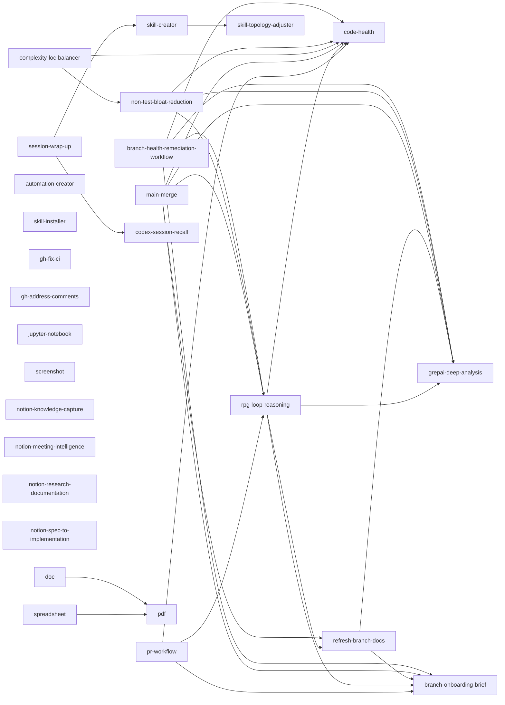

# Skill Topology

## Purpose

Define ownership and delegation boundaries across installed skills so specialist procedures live in one place and orchestrators stay thin.

## Ownership Rules

1. Keep specialist protocols in specialist skills.
2. Keep orchestration skills focused on sequence, gating, and output contracts.
3. Delegate by skill name; do not duplicate another skill's low-level checklist.
4. Keep delegation shallow by default: orchestrator -> specialist.
5. Allow one composed handoff only through designated `specialist-orchestrator` nodes when it replaces duplicated internals.

## Role Map

| Skill | Role | Primary Ownership |
| --- | --- | --- |
| `skill-creator` | meta | skill design rules and structure |
| `skill-topology-adjuster` | utility | topology role classification, ownership boundaries, and delegation graph updates |
| `skill-installer` | meta | install/list external skills |
| `automation-creator` | utility | Codex automation directives |
| `codex-session-recall` | utility | session log recall and filtering |
| `branch-onboarding-brief` | specialist | branch diff onboarding and briefing |
| `code-health` | specialist | code-health pipeline and risk summary |
| `grepai-deep-analysis` | specialist | deep code analysis protocol |
| `refresh-branch-docs` | specialist-orchestrator | doc impact mapping and branch-grounded doc rewrite |
| `gh-fix-ci` | specialist | GitHub Actions failure triage and fix gating |
| `gh-address-comments` | specialist | PR comment retrieval and response workflow |
| `pdf` | specialist | PDF rendering and visual QA |
| `doc` | specialist | DOCX editing and conversion workflow |
| `spreadsheet` | specialist | spreadsheet modeling/editing workflow |
| `jupyter-notebook` | specialist | notebook scaffold/edit workflow |
| `screenshot` | specialist | OS-level screenshot capture |
| `notion-knowledge-capture` | specialist | Notion knowledge capture and structured write-back |
| `notion-meeting-intelligence` | specialist | Notion-backed meeting preparation and agenda intelligence |
| `notion-research-documentation` | specialist | multi-source Notion research synthesis and documentation |
| `notion-spec-to-implementation` | specialist | convert Notion specs into implementation plans and tracking |
| `rpg-loop-reasoning` | specialist-orchestrator | dual-view closed-loop repository reasoning and incremental RPG evolution |
| `branch-health-remediation-workflow` | orchestrator | branch onboarding + health + grepai remediation synthesis |
| `non-test-bloat-reduction` | orchestrator | per-commit non-test intent-compression and bloat reduction |
| `complexity-loc-balancer` | orchestrator | complexity reduction with non-test net growth guardrail |
| `main-merge` | orchestrator | merge sequence and conflict/doc handoff |
| `pr-workflow` | orchestrator | PR briefing/creation flow and release gating |
| `session-wrap-up` | orchestrator | session-end insight synthesis and skill/topology handoff |

## Orchestration Layers

```text
Layer 0: Meta/Utility
  skill-creator, skill-topology-adjuster, skill-installer, automation-creator,
  codex-session-recall

Layer 1: Specialists (single-domain ownership)
  branch-onboarding-brief, code-health, grepai-deep-analysis, gh-fix-ci,
  gh-address-comments, pdf, doc, spreadsheet, jupyter-notebook, screenshot,
  notion-knowledge-capture, notion-meeting-intelligence,
  notion-research-documentation, notion-spec-to-implementation

Layer 2: Specialist-Orchestrators (dual-view or doc-impact composition)
  rpg-loop-reasoning, refresh-branch-docs

Layer 3: Primary Orchestrators (task-level delivery ownership)
  branch-health-remediation-workflow, non-test-bloat-reduction,
  complexity-loc-balancer, main-merge, pr-workflow, session-wrap-up
```

## Delegation Graph



## Delegation Tree (Operational View)

```mermaid
flowchart TD
  ROOT["Skill Topology"]

  ROOT --> ORCH["Primary Orchestrators"]
  ORCH --> BHRW["branch-health-remediation-workflow"]
  ORCH --> NTBR["non-test-bloat-reduction"]
  ORCH --> CLB["complexity-loc-balancer"]
  ORCH --> MM["main-merge"]
  ORCH --> PR["pr-workflow"]
  ORCH --> SWU["session-wrap-up"]

  ROOT --> HYB["Specialist-Orchestrators"]
  HYB --> RLR["rpg-loop-reasoning"]
  HYB --> RBD["refresh-branch-docs"]

  BHRW --> BOB["branch-onboarding-brief"]
  BHRW --> CH["code-health"]
  BHRW --> GDA["grepai-deep-analysis"]
  BHRW --> RLR

  NTBR --> CH
  NTBR --> GDA
  NTBR --> RLR

  CLB --> NTBR
  CLB --> CH

  MM --> BOB
  MM --> RBD
  MM --> GDA
  MM --> CH
  MM --> RLR

  RBD --> GDA
  RBD --> BOB

  PR --> BOB
  PR --> CH
  PR --> RLR

  SWU --> SC["skill-creator"]
  SWU --> CSR["codex-session-recall"]
  SC --> STA["skill-topology-adjuster"]

  RLR --> BOB
  RLR --> GDA
  RLR --> CH
  RLR --> RBD

  ROOT --> DOCOPS["Document/Data Specialists"]
  DOCOPS --> DOC["doc"]
  DOCOPS --> PDF["pdf"]
  DOCOPS --> SS["spreadsheet"]
  DOCOPS --> JNB["jupyter-notebook"]
  DOCOPS --> SHOT["screenshot"]

  ROOT --> NOTION["Notion Specialists"]
  NOTION --> NKC["notion-knowledge-capture"]
  NOTION --> NMI["notion-meeting-intelligence"]
  NOTION --> NRD["notion-research-documentation"]
  NOTION --> NSI["notion-spec-to-implementation"]

  DOC --> PDF
  SS --> PDF

  ROOT --> META["Meta and Utility"]
  META --> SC["skill-creator"]
  META --> STA["skill-topology-adjuster"]
  META --> SI["skill-installer"]
  META --> AC["automation-creator"]
  META --> CSR["codex-session-recall"]
  META --> GHF["gh-fix-ci"]
  META --> GHC["gh-address-comments"]
```



## Refactor Checklist

1. Identify duplicated procedures in non-owning skills.
2. Move details to the owning skill.
3. Replace duplicates with explicit delegation text.
4. Validate all edited skills with `quick_validate.py`.

## New Skill Onboarding Checklist

1. Classify the new skill role: `specialist`, `orchestrator`, `utility`, or `meta`.
2. Add the skill to the role map.
3. Add delegation edges to the graph only when they are real runtime handoffs.
4. Keep delegation depth to one hop by default; allow one composed handoff only via listed specialist-orchestrators.
5. Ensure specialist internals are not duplicated in orchestrators.
6. Validate the skill with `quick_validate.py`.
