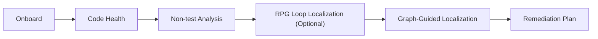

# Branch Health Remediation Workflow

## Overview
Run a sequential workflow: onboard the current branch, assess code health, analyze non-test inefficiency, run graph-guided localization, then propose a minimal, deletion-first remediation plan aligned with branch goals. Prefer `rpg-loop-reasoning` for dual-view (semantic + topology) localization when candidates span multiple modules.



## Workflow

0. Preflight path guardrails (before repo scripts/shared paths).
Use existence checks first for path-sensitive steps:
- `test -f scripts/collect_branch_info.py` before onboarding script usage.
- `test -d "$CODEX_HOME/shared/code-health"` before reading shared health outputs.
- Use `rg --files` as a secondary check when path assumptions are unclear.
If a required path is missing, skip that path and continue with fallback branch context commands:
- `git log --since=1.week --name-only`
- `git diff --stat`

1. Onboard the branch.
Run the `branch-onboarding-brief` skill first.
Proceed immediately to the next phases without asking for approval.

2. Run code health.
Use the `code-health` skill.
Keep non-test diff minimization central and call out net non-test growth.

3. Analyze non-test inefficiency and fragmentation.
Use the `grepai-deep-analysis` skill by default and follow its Deep Analysis Protocol.
Non-test scope: exclude `tests/`, `**/test_*.py`, `**/*_test.py`, `**/conftest.py`.
If grepai results include tests, re-run with narrower entry points or ignore test-only hits in synthesis.
Focus areas: hot loops, large functions, duplicate logic, repeated normalization, cache misuse, redundant I/O, and split responsibilities across many small modules.
Read `references/non_test_grepai_queries.md` for query templates before the first pass.

4. Delegate to `rpg-loop-reasoning` when dual-view localization is needed.
Use `rpg-loop-reasoning` in `hybrid` mode when at least one condition holds:
- high-yield candidates touch 2+ modules
- dependency drift is suspected from code-health or trace output
- branch objective requires both understanding and generation-style planning
If none hold, continue with direct `grepai-deep-analysis` localization.

5. Run graph-guided localization on top candidates.
For each high-yield candidate, anchor proposed changes with:
- one topology path (caller/callee or dependency chain)
- one symbol-level anchor (`rg -n`)
- one test/spec anchor when available
Reject candidates that cannot be localized with these anchors.

6. Synthesize remediation plan.
Provide a plan that aligns with branch objectives and reduces non-test LOC when possible.
Prefer deletion, inlining, and consolidation over new abstractions.
Separate confirmed findings, hypotheses, and proposed edits.
Recommend tests only where behavior risk is non-trivial.
Include a structural impact check per proposal:
- dependency boundary touched
- module ownership change
- risk of cross-module drift

## Sub-Agent Delegation (Scenario-Bound)
- If branch-wide evidence collection becomes heavy (onboarding + health + deep analysis across many modules), optionally delegate bounded scan passes to `codex-exec-sub-agent`.
- Keep orchestration ownership in this skill; use sub-agent output as evidence input, not as final remediation authority.
- Use prompt files and timeouts for deterministic runs.

```bash
~/.codex/skills/codex-exec-sub-agent/scripts/run.sh --timeout-sec 600 --prompt-file /full/path/prompt.txt
```

## Output Contract (chat)
- Answer first with the remediation plan summary.
- Provide an ASCII flow diagram.
- Provide evidence list with file paths and key symbols.
- Provide risks and unknowns.
- Include a compact structural impact table (proposal -> boundaries -> risk).

## Delegation Boundaries
- `branch-onboarding-brief` owns branch onboarding collection and briefing.
- `code-health` owns health pipeline execution and health metrics.
- `grepai-deep-analysis` owns deep-analysis protocol and evidence gating.
- `rpg-loop-reasoning` owns dual-view closed-loop localization and incremental evolution planning.
- This skill owns sequencing and non-test remediation synthesis.

## Resources
- `references/non_test_grepai_queries.md`
