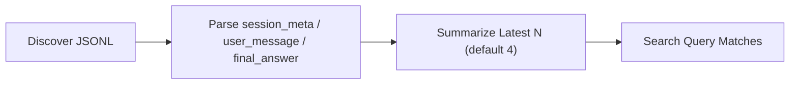

# Codex Session Recall

## Overview

Load recent session summaries fast, then drill down with keyword search to recover reusable requirements, decisions, and final outputs from prior Codex runs.

## Workflow

1. Resolve `CODEX_HOME` and run quick summary:
```bash
export CODEX_HOME="${CODEX_HOME:-$HOME/.codex}"
python "$CODEX_HOME/skills/codex-session-recall/scripts/session_recall.py"
```

2. Expand scope when needed:
```bash
python "$CODEX_HOME/skills/codex-session-recall/scripts/session_recall.py" --limit 8
```

3. Search for reusable details:
```bash
python "$CODEX_HOME/skills/codex-session-recall/scripts/session_recall.py" --limit 12 --query "anomaly"
```

4. Limit verbose match output per session when needed:
```bash
python "$CODEX_HOME/skills/codex-session-recall/scripts/session_recall.py" --limit 12 --query "anomaly" --max-matches-per-session 3
```

5. Return machine-readable output for downstream processing:
```bash
python "$CODEX_HOME/skills/codex-session-recall/scripts/session_recall.py" --format json --limit 6
```

## Output Contract

- Always include: session timestamp, session id, cwd, source file path.
- Include latest user request snippet and latest assistant final answer snippet.
- If `--query` is set, add match snippets from both user messages and assistant final answers.
- Prefer `--match-only` when user asked for targeted recall.



## Script

- `scripts/session_recall.py`
  - Default: latest `4` sessions
  - Sources: `~/.codex/sessions/**.jsonl` + `~/.codex/archived_sessions/*.jsonl`
  - Flags:
    - `--limit N`
    - `--query TEXT`
    - `--match-only`
    - `--max-matches-per-session N` (`0` means unlimited)
    - `--no-archived`
    - `--format text|json`
