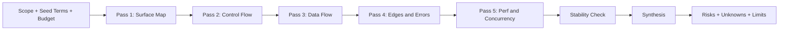

# Grepai Deep Analysis

## Overview
Use a noise-aware multi-pass workflow to build a stable mental model of code behavior without wasting iterations. Repeat passes only while signal quality is improving, then synthesize a brief with explicit evidence and limitations.
Treat `grepai search` as discovery only, and ground final claims with dual-view anchors: semantic + topology + validation.

## Workflow

### 0. Set Scope, Seeds, and Budget (Required)
- Identify the user goal and define the boundary of analysis.
- Start with 2 to 5 seed terms (domain noun, symbol, entry function).
- Set run budget:
  - max 3 `grepai search` queries per cycle
  - max 4 trace roots per cycle
  - max 2 retries for any single failure mode
- Track a retry ledger with tags: `search-noisy`, `trace-empty`, `trace-overbroad`, `symbol-collision`.

### 0.5 Search-then-Zoom (Required)
- Use a two-step retrieval discipline:
  - `Search`: map likely modules/symbols quickly with compact queries.
  - `Zoom`: lock onto 1 to 3 roots and confirm exact behavior with trace + `rg -n`.
- Do not keep broad search results as final evidence.
- Before synthesis, ensure each key claim can be traversed from a concrete root symbol.

### 1. Pass 1: Surface Map (Discovery Only)
- Use `grepai search "<query>" --json --compact --limit 15` to list likely entry points, key modules, and domain nouns.
- Immediately filter to branch-relevant paths (prefer `src/`), dedupe by file, and keep the top 10 to 15 hits.
- Capture filenames and symbols, not just match snippets.
- Do not use `search` output alone as final evidence.
- Noise gate:
  - If non-`src/` hits exceed 40%, or top hits are weak/non-specific, treat output as noisy.
  - Rewrite query once with sharper domain terms or exact symbols.
  - If still noisy, stop broad search and derive roots via `rg -n`.
- If grepai is unavailable or fails, fall back to `rg` and record the limitation.

### 2. Pass 2: Control Flow (Trace with Quality Gates)
- Use `grepai trace graph` from narrow roots first (exact function > class.method > module entry).
- Start with depth 3 to 4; increase to 5 to 6 only when needed.
- For each trace result, compute quality:
  - `node_count == 0` means unresolved root (`trace-empty`)
  - `node_count > 120` or `edge_count > 600` means over-broad root (`trace-overbroad`)
- Recovery rules:
  - `trace-empty`: retry with `--mode precise`, then try symbol variants.
  - `trace-overbroad`: lower depth and split into child roots.
  - `symbol-collision`: qualify symbol by module/class and verify with `rg -n`.
- Use `trace callers`/`trace callees` to validate entry and exit boundaries.
- Treat the resulting trace edges as topology anchors for downstream claims.

### 3. Pass 3: Data Flow
- Use narrow `grepai search` queries to discover candidate symbols for data transformation.
- Verify symbol locations and usage with `rg -n` before keeping the claim.
- Trace data structures, mutable state, caches, and normalization steps.
- Identify implicit contracts or required fields (types, enums, schemas).

### 4. Pass 4: Edges and Errors
- Search for error handling, warnings, and fallbacks.
- Identify edge conditions and behavior under invalid inputs.
- Capture any recovery or defaulting paths.

### 5. Pass 5: Perf and Concurrency
- Locate loops, expensive computations, I/O, and caching.
- Identify async or background work patterns.
- Note any hotspots or potential contention points.

### 6. Stability Check and Stop Rules (Required)
- Re-run Pass 2 and Pass 3 only while signal keeps improving.
- Stop when either condition is met:
  - two consecutive cycles add fewer than 2 new evidence anchors
  - hypotheses stop changing after one full Pass 2 + Pass 3 cycle
- Hard stop when retry budget is exhausted; record limitations instead of looping.

### 7. Synthesis
- Produce a concise behavior model with evidence.
- Include a call graph summary, data flow narrative, and risk list.
- Ask exactly one question only if a blocking ambiguity remains.

### Evidence Quality Gate (Required)
- Do not keep a claim unless it has:
  - one semantic anchor (`grepai search` shortlist + exact symbol via `rg -n`)
  - one topology anchor (call/dependency path from `grepai trace`)
  - one validation anchor (test/spec, or explicit runtime/log evidence when tests are unavailable)
- If `trace` remains unavailable after budgeted retries, allow `rg + test/spec` only with capped confidence (`medium` max) and an explicit limitation note.
- Mark confidence as low when fewer than two anchor types are available.

### Failure Taxonomy and Recovery (Required)
- Classify major failures in one of four buckets and apply targeted recovery:
  - `search-exploration`: noisy retrieval, weak seeds, over-broad hit sets.
  - `reasoning-interpretation`: conflicting hypotheses, weak contract inference.
  - `context-scope`: wrong boundary, stale file selection, scope drift.
  - `tool-execution`: command/tool errors, empty outputs, parser failures.
- For each bucket, record one corrective action and one retry-count entry in the limitation log.

### Deep Analysis Protocol (Required)
- Apply the protocol in `references/scenarios.md` to every analysis request.
- Use `search -> filter -> trace -> rg verify -> evidence gate` as the default sequence.
- Prefer English queries in `grepai` commands.
- Prefer `trace graph` depth 3 to 6 for main flows, increasing depth only when necessary.
- Validate cross-module contracts (types, schemas, enums) and note invariants.
- Map tests/specs to code paths; require at least 2 evidence anchors per claim.
- Re-run Pass 2/3 until the model stops changing (stability check).
- Include a confidence note in synthesis (high/medium/low with rationale).

## Output Contract
- Provide a short behavior summary first.
- Provide an ASCII diagram of the flow in chat output.
- Provide an evidence list with file paths and key symbols.
- Label each evidence item as `trace`, `rg`, or `test/spec`.
- Provide risks and unknowns as separate lists.
- Include a limitation log with retry counts for `search-noisy`, `trace-empty`, `trace-overbroad`, and `symbol-collision`.

## Resources
- Read `references/scenarios.md` for multi-pass scenario recipes, failure-mode runbooks, and grepai query templates.
