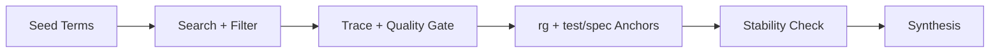

# Grepai Deep Analysis Scenarios

Use these recipes to run multi-pass analysis until the behavior model stabilizes. Replace placeholders like `<entry_fn>` and `<domain_term>` with real symbols discovered during Pass 1.



## Efficiency-First Protocol (Apply to All Scenarios)
Goal: Maximize signal per command and avoid retry loops caused by noisy search and unresolved trace roots.

Run budget per cycle:
1. Max 3 `grepai search` calls.
2. Max 4 trace roots (`trace graph/callers/callees` combined).
3. Max 2 retries per failure mode.

Stop rules:
1. Stop re-running Pass 2/3 when two cycles add fewer than 2 new evidence anchors.
2. Stop when hypotheses are unchanged after one full Pass 2+3 cycle.
3. If budget is exhausted, log limitations and continue with grounded evidence.

Failure taxonomy and actions:

| Failure tag | Detection signal | Required action |
| --- | --- | --- |
| `search-noisy` | Most hits outside `src/` or semantically broad | Rewrite query once with sharper symbols; then use `rg` for root discovery |
| `trace-empty` | `node_count == 0` | Retry with `--mode precise`; try symbol variants; verify symbol with `rg -n` |
| `trace-overbroad` | `node_count > 120` or `edge_count > 600` | Lower depth and split to child roots |
| `symbol-collision` | Unrelated callees/callers share same short name | Qualify by class/module and verify exact definition line with `rg -n` |

Evidence minimum:
1. Every claim needs one `trace` anchor and one `rg -n` anchor.
2. Add `test/spec` anchor when available.
3. If `trace` stays unavailable after retries, cap confidence at `medium` and state the limitation.

## Reusable Command Patterns
```bash
# 1) Discovery with filtering and dedupe
grepai search "<query>" --json --compact --limit 15 \
  | jq 'map(select(.file_path|startswith("src/"))) 
        | sort_by(.score) | reverse
        | unique_by(.file_path)
        | .[0:12]'

# 2) Root discovery fallback
rg -n "<entry_or_symbol>" src

# 3) Trace quality check (fast first)
grepai trace graph "<root_symbol>" --depth 4 --json \
  | jq '{root:.graph.root, node_count:(.graph.nodes|length), edge_count:(.graph.edges|length)}'

# 4) Trace retry in precise mode
grepai trace graph "<root_symbol>" --depth 4 --mode precise --json \
  | jq '{root:.graph.root, node_count:(.graph.nodes|length), edge_count:(.graph.edges|length)}'

# 5) Boundary validation
grepai trace callers "<root_symbol>" --mode precise --json
grepai trace callees "<root_symbol>" --mode precise --json

# 6) Grounding anchors
rg -n "<symbol>|<entry_fn>|<domain_term>" src tests docs
```

Symbol variant rescue order (for `trace-empty`):
1. `<symbol>`
2. `<ClassName>`
3. `<ClassName>.<method>`
4. `<module>.<ClassName>.<method>` (if known)

## Scenario 1: Feature Behavior Reconstruction
Goal: Explain how a feature produces output and where behavior branches.

Pass sequence:
1. Surface map for `<feature_term>` and `<entry_fn>`.
2. Trace primary call path from `<entry_fn>`.
3. Trace data transforms and normalization.
4. Capture edge/error paths and defaults.
5. Map supporting tests/specs.

Templates:
```bash
grepai search "<feature_term>" --json --compact --limit 15 | jq 'map(select(.file_path|startswith("src/"))) | .[0:12]'
grepai search "<entry_fn>" --json --compact --limit 15 | jq 'map(select(.file_path|startswith("src/"))) | .[0:12]'
grepai trace graph "<entry_fn>" --depth 4 --json
grepai trace graph "<entry_fn>" --depth 4 --mode precise --json
grepai trace callers "<entry_fn>" --mode precise --json
grepai trace callees "<entry_fn>" --mode precise --json
rg -n "<entry_fn>|<feature_term>" src tests docs
```

Expected output:
1. Behavior summary (5 to 8 sentences).
2. ASCII flow diagram.
3. Evidence list with `trace`, `rg`, `test/spec`.

## Scenario 2: End-to-End Pipeline Understanding
Goal: Trace data from ingestion through transformation to output/rendering.

Pass sequence:
1. Find ingestion, validation, transform, output roots.
2. Trace stage transitions with bounded depth.
3. Verify stage contracts with `rg` and tests.
4. Capture defaults/recovery for each stage.

Templates:
```bash
grepai search "<ingest_term>" --json --compact --limit 15 | jq 'map(select(.file_path|startswith("src/"))) | .[0:10]'
grepai search "<transform_term>" --json --compact --limit 15 | jq 'map(select(.file_path|startswith("src/"))) | .[0:10]'
grepai search "<output_term>" --json --compact --limit 15 | jq 'map(select(.file_path|startswith("src/"))) | .[0:10]'
grepai trace graph "<pipeline_entry>" --depth 4 --json
grepai trace callers "<pipeline_entry>" --mode precise --json
grepai trace callees "<pipeline_entry>" --mode precise --json
rg -n "<pipeline_entry>|<ingest_term>|<transform_term>|<output_term>" src tests docs
```

Expected output:
1. Stage-by-stage narrative.
2. Stage risks and confidence notes.

## Scenario 3: Bug Hypothesis Validation
Goal: Validate or falsify a suspected bug cause.

Pass sequence:
1. Locate error message or suspect symbol roots.
2. Trace suspect path and branch predicates.
3. Confirm data-state preconditions.
4. Map reproducing and non-reproducing conditions.
5. Link to existing tests or gaps.

Templates:
```bash
grepai search "<error_message>" --json --compact --limit 15 | jq 'map(select(.file_path|startswith("src/"))) | .[0:10]'
grepai search "<suspect_symbol>" --json --compact --limit 15 | jq 'map(select(.file_path|startswith("src/"))) | .[0:10]'
grepai trace graph "<suspect_entry>" --depth 4 --json
grepai trace graph "<suspect_entry>" --depth 4 --mode precise --json
grepai trace callers "<suspect_entry>" --mode precise --json
grepai trace callees "<suspect_entry>" --mode precise --json
rg -n "<error_message>|<suspect_symbol>|<suspect_entry>" src tests docs
```

Expected output:
1. Hypothesis verdict.
2. Reproduction conditions and blocking unknowns.

## Scenario 4: Refactor Readiness Map
Goal: Identify coupling hotspots and safe seams for change.

Pass sequence:
1. Map module boundaries and shared symbols.
2. Trace dependency direction from module entry roots.
3. Confirm shared mutable state and side effects.
4. Map tests that protect high-risk seams.

Templates:
```bash
grepai search "<module_name>" --json --compact --limit 15 | jq 'map(select(.file_path|startswith("src/"))) | .[0:12]'
grepai trace graph "<module_entry>" --depth 3 --json
grepai trace graph "<module_entry>" --depth 3 --mode precise --json
grepai trace callers "<module_entry>" --mode precise --json
grepai trace callees "<module_entry>" --mode precise --json
rg -n "<module_name>|<module_entry>" src tests docs
```

Expected output:
1. Coupling zones.
2. Refactor seams with hazard notes.

## Scenario 5: Performance Hotspot Recon
Goal: Find likely hotspots, repeated work, and cache opportunities.

Pass sequence:
1. Discover loops, repeated scans, and cache symbols.
2. Trace hotpath fan-out and depth.
3. Validate data-size assumptions and guardrails.
4. Confirm test/spec coverage for perf-sensitive paths.

Templates:
```bash
grepai search "cache" --json --compact --limit 15 | jq 'map(select(.file_path|startswith("src/"))) | .[0:10]'
grepai search "loop iteration repeated scan" --json --compact --limit 15 | jq 'map(select(.file_path|startswith("src/"))) | .[0:10]'
grepai trace graph "<hotpath_entry>" --depth 4 --json
grepai trace graph "<hotpath_entry>" --depth 4 --mode precise --json
grepai trace callers "<hotpath_entry>" --mode precise --json
grepai trace callees "<hotpath_entry>" --mode precise --json
rg -n "cache|for |while |<hotpath_entry>" src tests docs
```

Expected output:
1. Hotspot list and probable cause.
2. Measurement points and confidence.

## Scenario 6: Type Model Relationship Map
Goal: Explain ownership and lifecycle of a core type across modules.

Pass sequence:
1. Locate type definition and factories/builders.
2. Trace callers and callees around constructor/factory roots.
3. Verify where the type is mutated/read/rendered.
4. Confirm invariants and optional-field handling.

Templates:
```bash
grepai search "<type_name>" --json --compact --limit 15 | jq 'map(select(.file_path|startswith("src/"))) | .[0:12]'
grepai trace callers "<factory_or_builder>" --mode precise --json
grepai trace callees "<factory_or_builder>" --mode precise --json
grepai trace graph "<factory_or_builder>" --depth 4 --mode precise --json
rg -n "<type_name>|<factory_or_builder>" src tests docs
```

Expected output:
1. Relationship map (creator, consumer, mutator).
2. Contract summary (required fields, optional fields, invariants).
