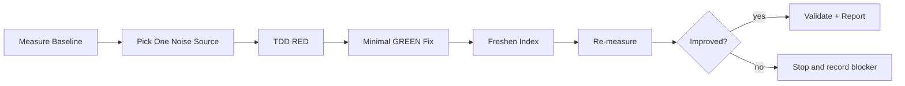

# Grepai Trace Noise Remediation

## Overview
Run a deterministic noise-reduction loop for `grepai trace graph` outputs. Keep each iteration bounded to one measurable noise source and verify with tests plus before/after graph metrics.



## Ownership
- Owns trace-noise triage, bounded remediation sequencing, and metric comparison.
- Delegates test protocol discipline to `test-driven-development`.
- Delegates completion verification to `verification-before-completion`.

## Trigger Conditions
Use this skill when one of these is true:
- `trace graph` edge fan-out is unexpectedly large for narrow roots.
- output includes obvious artifacts (`func`, string/comment tokens, declaration self-edges).
- graph output does not change after parser/index-related code changes.

## Workflow

### 1) Baseline Measurement
Run fixed roots first to stabilize comparisons:

```bash
go run ./cmd/grepai trace graph runWatchForeground --depth 2 --mode precise --json | jq '{root:.graph.root,node_count:(.graph.nodes|length),edge_count:(.graph.edges|length)}'
go run ./cmd/grepai trace graph watchProject --depth 2 --mode precise --json | jq '{root:.graph.root,node_count:(.graph.nodes|length),edge_count:(.graph.edges|length)}'
go run ./cmd/grepai trace graph discoverWorktreesForWatch --depth 2 --mode precise --json | jq '{root:.graph.root,node_count:(.graph.nodes|length),edge_count:(.graph.edges|length)}'
```

### 2) Pick One Noise Source
Choose one source only per iteration:
- declaration self-edge artifact
- unrelated inbound expansion from intermediate nodes
- string/comment/anonymous-func extraction artifacts

### 3) TDD RED
- Write one failing test in `trace/store_graph_test.go` or `trace/extractor_test.go`.
- Confirm failure cause matches the chosen source.

### 4) Minimal GREEN Fix
- Apply the smallest production change that makes the new test pass.
- Avoid multi-source refactors in the same iteration.

### 5) Index Freshness Gate
If changes affect symbol extraction/indexing inputs (`trace/extractor*`, `trace/patterns*`, `trace/store*`, `cli/watch*`), refresh index before re-measuring:

```bash
# stop background watcher if running
(go run ./cmd/grepai watch --stop || true)

# bounded foreground refresh
( go run ./cmd/grepai watch > /tmp/grepai_watch_refresh.log 2>&1 ) &
pid=$!
sleep 20
kill -INT "$pid" || true
wait "$pid" || true

# optional background restart
go run ./cmd/grepai watch --background || true
```

Or use bundled helper: `scripts/reindex_and_measure.sh`.

### 6) Verification
Minimum required checks:

```bash
go test ./trace -count=1
go test ./... -count=1
go vet ./...
go test -race ./cli ./trace ./mcp ./rpg -count=1
```

### 7) Re-measure and Decide
Re-run baseline roots and compare edge deltas.
- Keep the iteration only if target metric improved and tests stayed green.
- If no improvement, revert the hypothesis (not necessarily code) and record blocker.

## Output Contract
Return in this order:
1. One-line result (`improved` / `blocked`).
2. ASCII snapshot.
3. Baseline vs after table (`root`, `node_count`, `edge_count`, delta).
4. Tests/commands run.
5. Open risks and next single target.

ASCII snapshot format:

```text
[Baseline] -> [One Noise Source] -> [RED] -> [GREEN] -> [Freshen Index] -> [Re-measure]
```

## Resources
- `references/noise-patterns.md`
- `scripts/reindex_and_measure.sh`
