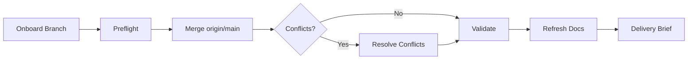

# Main Merge

## Overview

Run a predictable integration workflow that keeps branch intent intact while absorbing main updates.
Always gather onboarding evidence first, then merge, resolve conflicts, validate behavior, and refresh docs.



## Workflow

1. Run branch onboarding first (required).
Delegate branch diff collection and risk briefing to `branch-onboarding-brief`.
Do not duplicate onboarding collection logic in this skill.

2. Run preflight checks.
Confirm repository state and block unsafe merges.

```bash
git rev-parse --is-inside-work-tree
git branch --show-current
git status --porcelain
git fetch origin main
```

If `git status --porcelain` is non-empty, stop and ask one targeted question before proceeding.
Do not auto-stash, reset, or discard changes.

3. Merge `origin/main` into the current branch.

```bash
git merge origin/main
```

4. Resolve conflicts when merge reports `CONFLICT`.
List unresolved files:

```bash
git diff --name-only --diff-filter=U
```

Follow `references/conflict_playbook.md` for resolution patterns.
If conflict intent spans multiple modules or boundaries are unclear, delegate localization to `rpg-loop-reasoning` in `hybrid` mode before editing files.
Use `rg -n` and focused tests to verify each resolved symbol.
When all conflicts are resolved:

```bash
git add <resolved-files>
git merge --continue
```

5. Validate post-merge behavior.
Run the smallest meaningful checks first, then expand only for touched risk areas.
Prefer project commands when available (for example `make test`, targeted pytest, or lint).
Report only commands actually executed.

6. Refresh docs after code is stable.
Delegate documentation impact mapping and rewrite to `refresh-branch-docs`.
Apply the checklist in `references/doc_refresh_checklist.md` after delegation output is produced.

7. Deliver integration brief.
Include:
- merge result (clean/conflicted/resolved)
- resolved conflict files and strategy
- validation commands + results
- updated doc list with evidence anchors

## Output Contract (chat)

- Put merge outcome first.
- Include one ASCII process map:

```text
[Onboard] -> [Preflight] -> [Merge] -> [Resolve] -> [Validate] -> [Docs]
```

- Separate `Confirmed` and `Open Risks`.
- Ask exactly one question only when blocked.

## Cross-Skill Usage

- `branch-onboarding-brief`: mandatory before merge.
- `refresh-branch-docs`: mandatory after merge succeeds.
- `rpg-loop-reasoning`: preferred when conflict intent spans multiple modules or needs dual-view (semantic + topology) resolution.
- `grepai-deep-analysis`: use for focused deep analysis when dual-view loop is not required.
- `code-health`: use when merge introduces large non-test churn or quality regressions.

## Resources

- `references/conflict_playbook.md`
- `references/doc_refresh_checklist.md`
