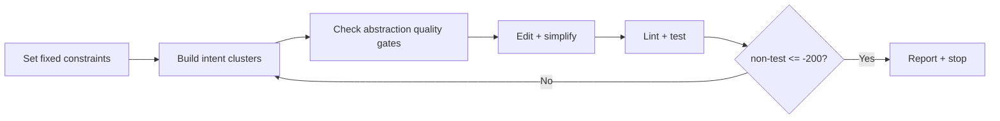

# Non-Test Bloat Reduction

## Overview

Run one deterministic cleanup loop per commit to reduce non-test code bloat with intent-first abstraction and deletion-first edits.
Treat syntax/method/API variation as possible surface variance of one domain intent, then compress each intent cluster into one robust abstraction.
Never satisfy the quota through comment/docstring-only churn.
Treat LOC reduction as valid only when code-health complexity gates (radon trend and xenon pass) remain satisfied.



## Philosophy

1. Assume intent first, implementation second.
- Treat "different method names with near-identical behavior" as one intent candidate.
- Treat "multiple key paths that call equivalent property/API access" as one intent candidate.
- Refuse to preserve variance that is only historical noise.

2. Accept abstraction only when it passes all three gates.
- Behavioral gate: preserve externally visible behavior for valid cases.
- Conceptual gate: represent a reusable domain concept, not a one-off control path.
- Physical gate: collapse duplicated logic into one maintainable location.

3. Optimize for compression of meaning, not only line count.
- Reduce LOC as a hard metric.
- Increase domain clarity as a hard quality metric.
- Pair deletion with selective abstraction/code compression when it lowers duplication and keeps complexity within gate.
- Reject refactors that merely move branches without reducing conceptual entropy.
- Reject reductions that only trim comments/docstrings without structural simplification.

4. Treat complexity budgets as first-class constraints.
- `radon` outcomes must stay stable or improve for touched runtime modules.
- `xenon` must pass with repository-configured thresholds on every cycle.
- If a reduction increases complexity enough to threaten xenon pass, redesign the abstraction before proceeding.

## Fragmentation Signatures

Use these signatures to identify high-yield reduction candidates:
- same predicate/branch family repeated in 2+ modules with slight naming drift
- thin wrappers that only rename/forward parameters
- repeated key normalization for the same conceptual field
- repeated mapping tables that encode the same domain relation
- split collectors/parsers that produce equivalent canonical outputs
- method fan-out where variants differ only by call path, not by business rule

## Workflow

1. Set fixed constraints first.
- Keep these constraints explicit for the whole run:
  - per-commit cadence: run exactly once per commit cycle
  - quota target: non-test net `<= -200` (preferred `<= -300`)
  - test code excluded from quota
  - complexity target: no radon regression on touched paths and mandatory xenon pass
- Optional: let the user override only the quota threshold; keep all other defaults stable across cycles.

2. Set scope and guardrails.
- Include core runtime code (`src/` domain/application modules and related non-test runtime modules).
- Exclude `tests/`, `**/test_*.py`, `**/*_test.py`, `**/conftest.py`.
- Exclude script/CLI glue by default: `src/scripts/`, `scripts/`, `tools/`, `bin/`, `**/management/commands/**`.
- Do not run a script-only reduction cycle unless the user explicitly opts in.
- Preserve behavior, avoid new dependencies, prefer deletion over abstraction.
- Treat visualization output as the primary human understanding surface; never remove or degrade visualized information solely to satisfy LOC reduction targets.
- Preserve naming/API compatibility unless there is explicit agreement to change it.
- Treat comment/docstring edits as secondary cleanup; exclude them from quota accounting.
- Each cycle must include at least one structural reduction (merge/delete/inline of executable logic).

```bash
export CODEX_HOME="${CODEX_HOME:-$HOME/.codex}"
```

3. Build intent clusters before editing.
- Use `code-health` and `grepai-deep-analysis` to gather candidate evidence.
- If clusters span multiple modules or show dependency drift, delegate localization to `rpg-loop-reasoning` in `hybrid` mode before proposing edits.
- Load both resources before the first pass:
  - `references/non_test_reduction_queries.md`
  - `references/intent_abstraction_rubric.md`
- Produce a cluster table with:
  - `intent_id`
  - `symbols/call_forms`
  - `shared rule`
  - `estimated removable LOC`
  - `behavioral_gate`
  - `conceptual_gate`
  - `physical_gate`
  - `risk`
- Do not propose edits before this table is emitted.

4. Run abstraction quality gates for each cluster.
- Keep a cluster only if all three gates pass: behavioral, conceptual, physical.
- Require a complexity screen before keeping the cluster: projected radon impact is non-regressive and xenon thresholds remain passable.
- If conceptual gate fails, prefer deletion/inline simplification instead of adding a new abstraction.
- If physical gate fails, block the change as "relabeling without compression."

5. Capture baseline and per-cycle deltas.
- Run compact diff summary before edits and after each cycle.

```bash
python "$CODEX_HOME/skills/code-health/scripts/diff_summary_compact.py"
```

6. Run edit pass.
- Apply top 1-3 highest conceptual-misalignment/high-yield candidates first.
- Do not defer a candidate only because it is medium/high risk when all abstraction gates pass.
- For medium/high-risk clusters, add or update focused validation coverage before structural edits.
- Use two-pass edits:
  - pass 1: make minimal correct change
  - pass 2: simplify further (delete wrappers/branches/helpers, inline one-off glue)
- Add abstractions only when `2+` call sites exist and net LOC still decreases.
- Block cycles that only remove comments/docstrings/formatting.
- Apply hard growth guardrail:
  - if working non-test net delta becomes `> 0`, immediately run a deletion pass before new helper extraction
  - if the guardrail cannot be restored in the same cycle, stop and report `guardrail_not_met`

7. Validate each cycle.
- Use repository-native commands first (`make lint`, `make test`, `make code-health`).
- Treat code-health complexity checks (`radon`, `xenon`) as blocking validation gates, not advisory signals.
- Always include a minimum targeted test set for touched modules (at least one focused test command that exercises edited runtime paths).
- Fallback commands:
  - `uv run ruff check src tests`
  - `uv run pytest tests -q --maxfail=1`
  - `uv run radon cc src -s -a`
  - `uv run xenon src`

8. Gate and iterate.
- Recompute non-test delta after validation.
- Success gate:
  - non-test net `<= -200` (preferred `<= -300`)
  - no complexity regression on touched runtime code
  - xenon pass
- If gate is not met, repeat steps 3-8.
- Stop early only when two consecutive cycles add `< 50` projected removable LOC or remaining candidates fail abstraction gates with no credible safety harness; report blockers explicitly.

## Operational Noise Controls
- Use search-as-discovery: begin with 1-2 focused `rg` queries from `references/non_test_reduction_queries.md` before any broad sweep.
- Apply path filtering early: constrain discovery to `src/` and exclude `tests/`, `scripts/`, `tools/`, `bin/` unless the user opts in.
- Use trace-plus-rg evidence gating: escalate to `rg --files` or `find` only after a concrete module/symbol trace needs expansion.
- Avoid fallback loops: if the same command fails twice, switch once to bundled references or reduced scope and continue.

## Tool Compatibility Fallback Matrix

Use deterministic fallbacks when tool CLI contracts differ by version.

| Tool | Preferred | Fallback | Stop Condition |
| --- | --- | --- | --- |
| `grepai status/watch` | `--json` | run without `--json`, then continue with `grepai search --json --compact` | same command fails twice |
| `xenon` | project command from `make code-health` | quote exclude globs explicitly (example: `-e 'tests/*'`) | argument parsing still fails |
| topology/code-health scripts | `$CODEX_HOME` path | resolve with absolute `$HOME/.codex/...` path | path still unresolved |

When fallback is used, record one-line evidence in the cycle report.

## Sub-Agent Delegation (Scenario-Bound)
- If candidate-cluster discovery or repeated broad-path scans become long-running, optionally delegate isolated scan batches to `codex-exec-sub-agent`.
- Keep quota/control gates in this skill; sub-agent output is evidence only and must still pass local abstraction/complexity gates.
- Use bounded execution and keep JSONL traces for auditability.

```bash
~/.codex/skills/codex-exec-sub-agent/scripts/run.sh --timeout-sec 600 --prompt-file /full/path/prompt.txt
```

## Output Contract
- Start with an intent-cluster table first (mandatory).
- Required columns:
  - `intent_id`
  - `symbols/call_forms`
  - `shared_rule`
  - `projected_removable_loc`
  - `behavioral_gate`
  - `conceptual_gate`
  - `physical_gate`
  - `risk`
- After the table, report gate verdict (`met` or `not met`) and current non-test net delta.
- Report executable-code delta separately from comment/docstring delta.
- Report `radon` delta (or no-regression confirmation) and `xenon` pass/fail separately from LOC metrics.
- Include an ASCII loop snapshot.
- Include an intent cluster summary (`before clusters -> after clusters`).
- Separate `applied reductions` from `next identifiable reductions`.
- Keep test-code metrics in a separate line and exclude them from target calculations.
- Keep script-code metrics in a separate line and exclude them from target calculations unless script scope was explicitly requested.
- Provide risks, unknowns, and highest-yield next deletion targets.

## Delegation Boundaries
- `code-health` owns health metrics and diff summary tooling.
- `code-health` also owns complexity gate evidence (`radon`/`xenon`) for this workflow.
- `grepai-deep-analysis` owns deep evidence gathering and confidence gates.
- `rpg-loop-reasoning` owns dual-view localization and incremental delta framing when cluster intent crosses module boundaries.
- This skill owns loop control, per-commit discipline, and quota gating.
- This skill also owns intent clustering and abstraction gate decisions.

## Resources
- `references/non_test_reduction_queries.md`
- `references/intent_abstraction_rubric.md`
