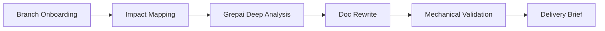

# Refresh Branch Docs

## Mission
Refresh internal docs so they match current branch behavior without losing map-first navigation quality.
Default to incremental delta refresh; use full refresh only when explicitly requested or when drift is widespread.
Collect evidence first, then rewrite docs with explicit anchors.



## Harness Alignment Goals

1. Keep `AGENTS.md` map-first, not encyclopedia-first.
2. Keep As-Is/To-Be SSOT boundaries explicit (`docs/_meta/docs-contract.md`).
3. Preserve progressive disclosure (`AGENTS.md` -> `docs/index.md` -> leaf docs).
4. Enforce docs integrity with machine checks (`docs-check` or equivalent).
5. Separate blocking fixes from doc-gardening backlog.

## Workflow (required order)

1. Collect branch onboarding context first.
Run `branch-onboarding-brief` before editing docs and reuse its outputs.
Capture changed files, net LOC, and high-churn non-test modules from onboarding output.

2. Read map and boundary docs first.
Read `AGENTS.md`, `docs/index.md`, and `docs/_meta/docs-contract.md` before drafting edits.
If local AGENTS are active, inventory `src/**/AGENTS.md` and keep chain consistency.

3. Choose refresh mode.
- Default: incremental refresh (delta-based) for touched areas.
- Use full refresh only if:
  - the user explicitly asks for comprehensive/full rewrite
  - symbol rename spans many docs
  - architecture shift invalidates existing doc boundaries

4. Build the documentation impact set.
Use `origin/main` as the default base to avoid stale-local-base drift.
Run:

```bash
python /Users/mrx-ksjung/.codex/skills/refresh-branch-docs/scripts/collect_doc_refresh_context.py --base origin/main --format md
```

Use `references/doc_update_matrix.md` to validate and expand candidate docs.
Always prioritize:
- docs already touched on branch
- docs mapped from high-churn non-test code paths
- API/spec docs that mention changed symbols
- map/contract docs (`AGENTS.md`, `docs/index.md`, `docs/_meta/docs-contract.md`) when doc navigation or boundaries changed

5. Run required deep analysis.
Delegate protocol execution to `grepai-deep-analysis`.
Use `references/grepai_doc_refresh_queries.md` only as doc-refresh-specific seed/query guidance.
Require evidence for each doc claim:
- one call-path anchor from `grepai trace`
- one symbol/usage anchor from `rg -n`
- one test/spec anchor when available

6. Rewrite internal docs with evidence.
For each target doc:
- replace stale behavior descriptions
- align names/signatures with current symbols
- update data shape tables and invariants
- update constraint/objective sections when rule semantics changed
- keep root AGENTS concise and pointer-oriented when touched

Avoid speculative text. If uncertain, mark it as unresolved and list missing evidence.

7. Validate doc consistency and mechanical guards.
Run quick drift checks:

```bash
rg -n "TODO|TBD|FIXME|\\bdeprecated\\b" docs
rg -n "<old_symbol>" docs
rg -n "<new_symbol>" docs
```

Run docs integrity gates:
- Preferred: `make docs-check` (if target exists).
- Fallback: run `scripts/check_code_paths.sh`, `scripts/check_make_targets.sh`, `scripts/check_md_links.py` directly.

Optionally run focused tests for changed behavior and report only tests that were actually executed.

8. Produce final delivery brief.
Report:
- updated docs list
- evidence links (file path + symbol)
- unresolved ambiguities
- follow-up items
- refresh mode used (incremental or full) and why
- whether upstream orchestration context (for example from `rpg-loop-reasoning`) was reused
- harness alignment status:
  - map-first AGENTS
  - SSOT boundary clarity
  - progressive disclosure integrity
  - mechanical validation status
  - doc-gardening backlog (if any)

## Output Contract (chat)
- Put the documentation refresh result first.
- Include an ASCII process map:

```text
[Onboard] -> [Map Docs] -> [Deep Analyze] -> [Rewrite] -> [Validate]
```

- Include evidence list with file paths and symbols.
- Separate confirmed updates and unresolved items.
- Ask exactly one question only when blocked.

## Delegation Boundaries

- `branch-onboarding-brief` owns branch diff collection and onboarding synthesis.
- `grepai-deep-analysis` owns noise control, pass sequencing, and evidence-gating protocol.
- `rpg-loop-reasoning` may supply upstream dual-view localization context; this skill remains the owner of doc impact mapping, doc rewrites, and doc consistency validation.

## Resources
- `scripts/collect_doc_refresh_context.py`: map branch diff to candidate docs.
- `../_shared/references/docs_harness_checklist.md`: shared harness checklist for map/SSOT/progressive-disclosure/docs-check.
- `references/doc_update_matrix.md`: code-path to doc mapping matrix.
- `references/grepai_doc_refresh_queries.md`: reusable grepai query sets for doc refresh.
