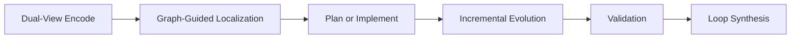

# RPG Loop Reasoning

## Overview

Use one loop for both directions of repository reasoning:
- comprehension: code -> intent
- generation: intent -> code

Keep both views synchronized with incremental updates instead of full re-analysis on every change.



## Workflow

1. Build a dual-view map first.
- Semantic view: capabilities, contracts, names.
- Topology view: call/dependency paths and module boundaries.
- Require `semantic + topology + validation` anchors before keeping any high-confidence claim.

2. Select the operating mode.
- `understanding`: prioritize localization, dependency tracing, failure explanation.
- `generation`: prioritize implementation order, interfaces, and dependency-safe synthesis.
- `hybrid`: run both and keep the same node set and constraints.

3. Run incremental evolution.
Use branch deltas to avoid full rebuild:

```bash
python /Users/mrx-ksjung/.codex/skills/rpg-loop-reasoning/scripts/collect_rpg_delta.py --base main --format md
```

Treat changes as:
- additions -> insert new nodes/edges
- modifications -> refresh semantics, move nodes only when intent shifts
- deletions -> prune nodes and empty parents
- renames -> keep continuity via mapping instead of delete+add when possible

4. Execute graph-guided localization or generation.
Use query packs:

```bash
python /Users/mrx-ksjung/.codex/skills/rpg-loop-reasoning/scripts/rpg_query_pack.py --mode understanding
python /Users/mrx-ksjung/.codex/skills/rpg-loop-reasoning/scripts/rpg_query_pack.py --mode generation
```

5. Validate loop outputs.
- Confirm structural boundaries and dependency consistency.
- Confirm tests/spec checks for touched behavior.
- Confirm unresolved items are explicitly tracked.

6. Synthesize the loop result.
- Separate: confirmed, hypotheses, unresolved.
- Include one risk table and one next-iteration delta plan.

## Sub-Agent Delegation (Scenario-Bound)
- If dual-view verification requires independent passes (semantic/topology separation) or large cross-module scans, optionally delegate one bounded pass to `codex-exec-sub-agent`.
- Keep loop-state decisions in this skill and treat sub-agent output as supporting evidence.
- Use prompt files and explicit timeout to avoid unbounded nested runs.

```bash
~/.codex/skills/codex-exec-sub-agent/scripts/run.sh --timeout-sec 600 --prompt-file /full/path/prompt.txt
```

## Output Contract (chat)

- Put the decision first: `understanding`, `generation`, or `hybrid`.
- Include an ASCII loop map:

```text
[Encode] -> [Localize] -> [Plan/Implement] -> [Evolve] -> [Validate] -> [Synthesize]
```

- Include evidence list with explicit tags:
  - `semantic`
  - `topology`
  - `validation`
- Include failure taxonomy summary (`search`, `reasoning`, `context`, `tool`).
- Ask exactly one question only when blocked.

## Delegation Boundaries

- `branch-onboarding-brief` owns branch diff onboarding context and can be delegated for entry-point seeding before deep dual-view cycles.
- `grepai-deep-analysis` owns deep evidence protocol and noise control.
- `code-health` owns quality metric pipeline.
- `refresh-branch-docs` owns documentation rewrite workflow.
- This skill owns closed-loop orchestration, dual-view alignment, and incremental evolution strategy.
- Upper orchestrators (`branch-health-remediation-workflow`, `non-test-bloat-reduction`, `main-merge`, `pr-workflow`) may delegate dual-view localization here; this skill does not take over their approval gates or final delivery ownership.

## Resources

- `references/rpg_loop_protocol.md`: detailed operating protocol.
- `references/failure_modes.md`: failure taxonomy and mitigations.
- `scripts/collect_rpg_delta.py`: collect branch deltas for incremental evolution.
- `scripts/rpg_query_pack.py`: reusable query packs for understanding/generation/hybrid modes.
