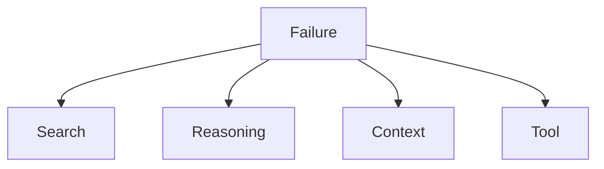

# Failure Modes

## Taxonomy

## Buckets

### Search
- Symptoms: noisy retrieval, weak seed terms, redundant exploration.
- Mitigation:
  - sharpen query terms
  - reduce breadth
  - switch to root-symbol-first tracing

### Reasoning
- Symptoms: conflicting hypotheses, wrong invariant inference, unstable conclusions.
- Mitigation:
  - require stronger topology anchors
  - enforce claim-level confidence labels
  - remove unsupported claims

### Context
- Symptoms: wrong scope, stale files, mixed boundaries.
- Mitigation:
  - restate boundaries
  - rebuild impacted file list from delta
  - separate unrelated modules

### Tool
- Symptoms: command failures, empty outputs, parser drift.
- Mitigation:
  - record exact failure
  - retry with constrained input
  - fallback to `rg`/native git data and mark confidence cap

## Reporting Rule

Always report:
- dominant failure bucket
- one concrete corrective action
- retry count used
