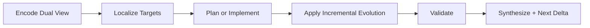

# RPG Loop Protocol

## Purpose

Run repository reasoning as a closed loop instead of separate workflows:
- code comprehension (`code -> intent`)
- code generation (`intent -> code`)

## Loop States

## Required Anchors

Each claim must include:
- `semantic`: symbol, contract, or capability anchor
- `topology`: caller/callee/dependency path anchor
- `validation`: test/spec or runtime evidence

## Mode Rules

### understanding
- Start from issue/task intent.
- Localize to concrete files/functions/classes.
- Keep edits out of scope unless requested.

### generation
- Start from target capability and interfaces.
- Enforce dependency-safe implementation order.
- Confirm compatibility with existing module boundaries.

### hybrid
- Use one shared node set and constraints for both directions.
- Reconcile conflicts before implementation.

## Incremental Evolution Rules

1. Parse branch delta.
2. Classify each change as `add`, `modify`, `delete`, `rename`.
3. Update only affected nodes and edges.
4. Rebuild globally only when large structural refactor invalidates local updates.

## Deliverable Shape

1. Mode decision and rationale.
2. Evidence table with anchor types.
3. Confirmed changes vs unresolved uncertainties.
4. Next-iteration delta plan.
