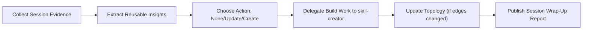

# Session Wrap Up

## Overview

Run a deterministic session-closing flow that turns session outcomes into reusable skill actions. Own synthesis and prioritization. Delegate all skill implementation mechanics to `skill-creator`.



## Workflow

1. Collect session evidence.
Capture goals, delivered outputs, repeated friction, failed attempts, and proven fixes from the current session.
Prefer concrete artifacts: changed file paths, command traces, and user correction points.

2. Extract reusable insights.
Classify each candidate into one of:
- trigger gap
- workflow gap
- ownership/delegation boundary gap
- reusable resource gap (script/reference/template)
Drop one-off observations that are unlikely to recur.

3. Decide action type per insight.
Choose `none` when value is non-reusable.
Choose `update-existing-skill` when ownership already exists.
Choose `create-new-skill` only when repeated value + clear ownership boundary are both true.

4. Delegate implementation to `skill-creator`.
Provide a compact handoff packet:
- proposed English skill name (hyphen-case, under 64 chars)
- role (`specialist`, `orchestrator`, `utility`, or `meta`)
- ownership statement
- delegation edges (one-hop only)
- required resources (`scripts/`, `references/`, `assets/`)
- validation scope (`quick_validate.py` + topology consistency)

5. Adjust skill orchestration topology.
If role map or edges changed, update:
- `skill-creator/references/skill_topology.md` role map
- delegation graph
- delegation tree
Reject designs that duplicate specialist internals instead of delegating.

6. Publish a session wrap-up report.
Follow the output contract below and keep recommendations executable in the next session.

Optional (heavy evidence scans): delegate bounded background analysis to `codex-exec-sub-agent` using quoting-safe invocation.

```bash
~/.codex/skills/codex-exec-sub-agent/scripts/run.sh --timeout-sec 600 --prompt-file /full/path/prompt.txt
```

Prefer workspace paths or `~/.codex/sub_agent_runs` for sub-agent output targets; avoid `/tmp`/`/var/tmp` paths when sandbox policies may block writes.

## Output Contract (chat)

Always return, in order:
1. Session result summary (answer-first, 3-5 lines).
2. ASCII flow snapshot.
3. Reusable insights list with action type (`none`, `update-existing-skill`, `create-new-skill`).
4. Delegation plan (`orchestrator -> specialist`) for each action.
5. Topology delta summary (if no change, say "no topology change").
6. Immediate next command/task for handoff.

ASCII flow format:

```text
[Session Evidence]
      |
      v
[Reusable Insight Extraction]
      |
      v
[Action Decision]
  |       |        |
 none   update   create
          \        /
           v      v
        [skill-creator]
              |
              v
       [Topology Check]
```

## Delegation Boundaries

- `session-wrap-up` owns end-of-session synthesis, prioritization, and orchestration decisions.
- `skill-creator` owns skill initialization/editing/validation procedures.
- `codex-session-recall` owns historical session retrieval when prior-session evidence is required.
- `codex-exec-sub-agent` is optional execution utility for long-running or fresh-context scans; keep delegation one-hop and bounded by timeout.
- This skill must not duplicate `skill-creator` internals; delegate instead.

## Naming Rules

- Convert Korean task labels to concise English action names.
- Prefer `verb-noun` or `noun-action` hyphen-case names.
- Default translation for this workflow:
  - Korean label: "세션 갈무리"
  - English skill name: `session-wrap-up`

## Reference

- `references/session_wrap_up_checklist.md`
