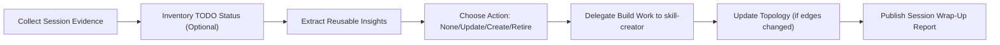

# Session Wrap Up

## Overview

Run a deterministic session-closing flow that turns session outcomes into reusable skill actions. Own synthesis and prioritization. Prefer strengthening installed skills over creating new ones. Delegate skill implementation mechanics to `skill-creator`, use `todo-inventory` when deferred-work evidence matters, and keep topology edits conditional.


```mermaid
flowchart LR
  A["Collect Session Evidence"] --> T["Inventory TODO Status (Optional)"]
  T --> B["Extract Reusable Insights"]
  B --> C["Choose Action: None/Update/Create/Retire"]
  C --> D["Delegate Build Work to skill-creator"]
  D --> E["Update Topology (if edges changed)"]
  E --> F["Publish Session Wrap-Up Report"]
```

## Workflow

1. Collect session evidence.
Capture goals, delivered outputs, repeated friction, failed attempts, and proven fixes from the current session.
Prefer concrete artifacts in this order:
- current task/result summary
- changed file paths, command traces, and validation output
- user correction points or repeated prompt steering
- local session artifacts (`.omx/notepad.md`, `.omx/state`, draft reports) when present
Do not invent history and do not assume a missing recall skill exists.
When deferred follow-up visibility matters, call `todo-inventory` to capture:
- remaining TODO markers in the relevant repo or module
- TODO markers newly added in the current diff
- skipped files and diff-availability caveats

2. Extract reusable insights.
Classify each candidate into one of:
- trigger gap
- workflow gap
- ownership/delegation boundary gap
- reusable resource gap (script/reference/template)
Drop one-off observations that are unlikely to recur.

3. Decide action type per insight.
Choose `none` when value is non-reusable.
Choose `update-existing-skill` when ownership already exists or when an installed skill is the obvious home.
Choose `create-new-skill` only when repeated value + clear ownership boundary + no installed owner are all true.
Choose retirement/removal guidance only when the asset is superseded or harmful; otherwise keep scope to additive updates.
If every candidate resolves to `none`, publish a no-op wrap-up and stop after reporting.

4. Delegate implementation to `skill-creator`.
Provide a compact handoff packet:
- proposed English skill name (hyphen-case, under 64 chars)
- target path (`$CODEX_HOME/skills/<skill-name>`)
- action (`update-existing-skill`, `create-new-skill`, `retire-skill`, or `none`)
- problem statement and reusable evidence
- frontmatter description delta (what to trigger on, what to stop claiming)
- role (`specialist`, `orchestrator`, `utility`, or `meta`)
- ownership statement
- delegation edges (one-hop only)
- required resources (`scripts/`, `references/`, `assets/`)
- interface check (`agents/openai.yaml` refresh needed or not)
- validation scope (`quick_validate.py` + topology consistency when role/edges changed)
- TODO status note (new TODOs added, remaining scoped TODOs, and follow-up reported without inline TODOs)

5. Adjust skill orchestration topology.
Only involve `skill-topology-adjuster` when role map, ownership, or delegation edges changed.
If topology changed, update:
- `skill-topology-adjuster/references/skill_topology.md` role map
- delegation graph
- delegation tree
Reject designs that duplicate specialist internals instead of delegating.
Do not reference non-installed skills in boundaries or handoff notes.

6. Publish a session wrap-up report.
Follow the output contract below and keep recommendations executable in the next session.

7. Emit sync-mode and retirement guidance when asset removal is involved.
If proposed actions remove/retire/rename skill folders or files, include:
- retirement path move first (`~/.codex/skills/<name>` -> `~/.codex/archived-skills/<name>`)
- mirror sync mode requirement (`./scripts/sync_and_push.sh --mirror ...`) so deletions are reflected in mirror/GitHub
- non-removal changes may use default merge sync

Optional (heavy evidence scans): delegate bounded background analysis to `codex-exec-sub-agent` using quoting-safe invocation.

```bash
~/.codex/skills/codex-exec-sub-agent/scripts/run.sh --timeout-sec 600 --prompt-file /full/path/prompt.txt
```

Prefer workspace paths or `~/.codex/sub_agent_runs` for sub-agent output targets; avoid `/tmp`/`/var/tmp` paths when sandbox policies may block writes.

## Decision Rules

- Bias toward `update-existing-skill` over `create-new-skill`.
- Keep delegation to installed skills only; if the owner is missing, either handle evidence locally or create a bounded proposal to add the owner.
- Allow `none` as a valid final action when the session produced no reusable pattern.
- Keep retirement guidance explicit and reversible; never recommend direct deletion from the mirror repo.
- Keep handoff packets small enough that `skill-creator` can act without re-deriving the session narrative.

## Output Contract (chat)

Always return, in order:
1. Session result summary (answer-first, 3-5 lines).
2. TODO status summary:
   - TODOs newly added in the current diff
   - remaining TODOs in scope
   - follow-up items reported without inline TODO markers, if any
3. Reusable insights list with action type (`none`, `update-existing-skill`, `create-new-skill`, `retire-skill`).
4. Delegation plan (`orchestrator -> specialist`) for each action.
5. Topology delta summary (if no change, say "no topology change").
6. Immediate next command/task for handoff (include sync mode: `merge` or `mirror`).
If every action is `none`, still emit all sections, include TODO status, and explicitly say `no-op wrap-up`.

## Delegation Boundaries

- `session-wrap-up` owns end-of-session synthesis, prioritization, and orchestration decisions.
- `skill-creator` owns skill initialization/editing/validation procedures.
- `todo-inventory` owns TODO inventory and diff-added TODO evidence gathering.
- `omx-workspace-prune` owns safe `.omx` cleanup and retention policy when wrap-up includes workspace pruning or retirement follow-through.
- Historical session retrieval defaults to direct inspection of available local artifacts and current thread context.
- `codex-exec-sub-agent` is optional execution utility for long-running or fresh-context scans; keep delegation one-hop and bounded by timeout.
- This skill must not duplicate `skill-creator` internals; delegate instead.

## Naming Rules

- Convert Korean task labels to concise English action names.
- Prefer `verb-noun` or `noun-action` hyphen-case names.
- Default translation for this workflow:
  - Korean label: "세션 갈무리"
  - English skill name: `session-wrap-up`

## Reference

- `references/session_wrap_up_checklist.md`
