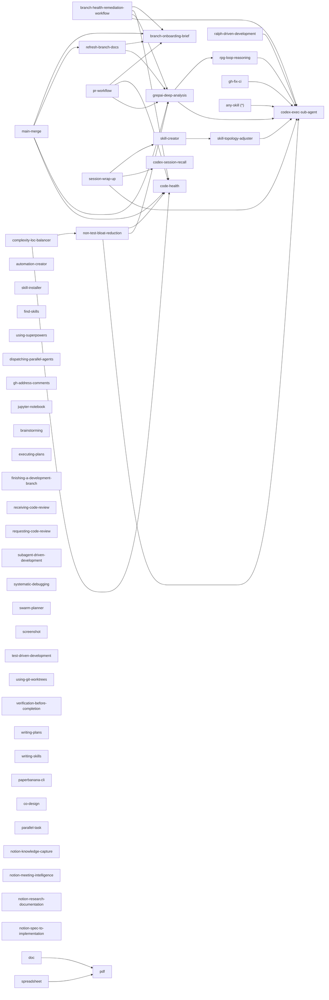

# Skill Topology

## Purpose

Define ownership and delegation boundaries across installed skills so specialist procedures live in one place and orchestrators stay thin.

## Ownership Rules

1. Keep specialist protocols in specialist skills.
2. Keep orchestration skills focused on sequence, gating, and output contracts.
3. Delegate by skill name; do not duplicate another skill's low-level checklist.
4. Keep delegation shallow by default: orchestrator -> specialist.
5. Allow one composed handoff only through designated `specialist-orchestrator` nodes when it replaces duplicated internals.

## Role Definitions

- `meta-orchestrator`: top-level orchestrator that can freely coordinate any role (`meta`, `meta-tool`, `utility`, `orchestrator`, `specialist-orchestrator`, `specialist`) based on scenario needs.
- `meta-tool`: cross-cutting tool role that can be reused by any skill role (`specialist`, `orchestrator`, `specialist-orchestrator`, `meta`, `meta-orchestrator`, `utility`) without fixed hard-coded delegation edges.

## Role Map

| Skill | Role | Primary Ownership |
| --- | --- | --- |
| `skill-creator` | meta | skill design rules and structure |
| `skill-topology-adjuster` | utility | topology role classification, ownership boundaries, and delegation graph updates |
| `skill-installer` | meta | install/list external skills |
| `find-skills` | utility | discover installable skills and recommend install paths |
| `automation-creator` | utility | Codex automation directives |
| `using-superpowers` | utility | universal skill invocation discipline at conversation start |
| `dispatching-parallel-agents` | utility | identify independent tasks and dispatch parallel agent work |
| `codex-session-recall` | utility | session log recall and filtering |
| `codex-exec-sub-agent` | meta-tool | isolated sub-agent execution and JSONL run capture |
| `agents-md-builder` | specialist | AGENTS.md authoring and quality rewrite workflow |
| `brainstorming` | specialist | requirement discovery and design shaping before implementation |
| `branch-onboarding-brief` | specialist | branch diff onboarding and briefing |
| `code-health` | specialist | code-health pipeline and risk summary |
| `executing-plans` | specialist | plan execution with checkpointed batch delivery |
| `finishing-a-development-branch` | specialist | branch completion workflow (verify, choose integration path, cleanup) |
| `grepai-deep-analysis` | specialist-orchestrator | deep code analysis protocol with dual-view augmentation gating |
| `receiving-code-review` | specialist | rigorous triage and validation of incoming review feedback |
| `refresh-branch-docs` | specialist-orchestrator | doc impact mapping and branch-grounded doc rewrite |
| `requesting-code-review` | specialist | pre-merge review request and findings handoff workflow |
| `gh-fix-ci` | specialist | GitHub Actions failure triage and fix gating |
| `gh-address-comments` | specialist | PR comment retrieval and response workflow |
| `pdf` | specialist | PDF rendering and visual QA |
| `doc` | specialist | DOCX editing and conversion workflow |
| `spreadsheet` | specialist | spreadsheet modeling/editing workflow |
| `jupyter-notebook` | specialist | notebook scaffold/edit workflow |
| `subagent-driven-development` | specialist | execute independent implementation tasks with fresh subagent loops |
| `swarm-planner` | specialist | dependency-aware plan synthesis for parallel execution |
| `systematic-debugging` | specialist | root-cause-first debugging protocol |
| `screenshot` | specialist | OS-level screenshot capture |
| `test-driven-development` | specialist | red-green-refactor implementation protocol |
| `using-git-worktrees` | specialist | isolated worktree setup and safety checks |
| `verification-before-completion` | specialist | completion gate enforcing fresh verification evidence |
| `writing-plans` | specialist | implementation plan authoring for multi-step tasks |
| `writing-skills` | specialist | skill authoring and validation workflow |
| `paperbanana-cli` | specialist | PaperBanana CLI execution for diagram/plot generation and evaluation |
| `notion-knowledge-capture` | specialist | Notion knowledge capture and structured write-back |
| `notion-meeting-intelligence` | specialist | Notion-backed meeting preparation and agenda intelligence |
| `notion-research-documentation` | specialist | multi-source Notion research synthesis and documentation |
| `notion-spec-to-implementation` | specialist | convert Notion specs into implementation plans and tracking |
| `rpg-loop-reasoning` | specialist | dual-view loop primitives and incremental RPG evolution packs for augmentation |
| `branch-health-remediation-workflow` | orchestrator | branch onboarding + health + grepai remediation synthesis |
| `non-test-bloat-reduction` | specialist-orchestrator | per-commit non-test intent-compression and bloat reduction |
| `complexity-loc-balancer` | orchestrator | complexity reduction with non-test net growth guardrail |
| `co-design` | orchestrator | design-aware parallel task execution with design-mode routing |
| `main-merge` | orchestrator | merge sequence and conflict/doc handoff |
| `parallel-task` | orchestrator | dependency-ordered parallel subagent task execution |
| `pr-workflow` | orchestrator | PR briefing/creation flow and release gating |
| `ralph-driven-development` | meta-orchestrator | unified Ralph loop policy across PRD iterations and ordered spec-runner delivery |
| `session-wrap-up` | orchestrator | session-end insight synthesis and skill/topology handoff |

## Orchestration Layers

```text
Layer 0: Meta/Meta-Tool/Utility
  skill-creator, skill-topology-adjuster, skill-installer, find-skills, automation-creator,
  using-superpowers, dispatching-parallel-agents,
  codex-session-recall, codex-exec-sub-agent, ralph-driven-development

Layer 1: Specialists (single-domain ownership)
  agents-md-builder, brainstorming, executing-plans, finishing-a-development-branch,
  receiving-code-review, requesting-code-review, subagent-driven-development,
  systematic-debugging, test-driven-development, using-git-worktrees,
  verification-before-completion, writing-plans, writing-skills,
  branch-onboarding-brief, code-health, rpg-loop-reasoning, gh-fix-ci,
  gh-address-comments, pdf, doc, spreadsheet, jupyter-notebook, screenshot,
  swarm-planner, paperbanana-cli, notion-knowledge-capture, notion-meeting-intelligence,
  notion-research-documentation, notion-spec-to-implementation

Layer 2: Specialist-Orchestrators (protocol ownership + composed handoff)
  grepai-deep-analysis, refresh-branch-docs, non-test-bloat-reduction

Layer 3: Primary Orchestrators (task-level delivery ownership)
  branch-health-remediation-workflow, complexity-loc-balancer,
  co-design, main-merge, parallel-task, pr-workflow,
  session-wrap-up

Layer 4: Sub-Agent Preferred Activators (optional, scenario-bound)
  grepai-deep-analysis, branch-health-remediation-workflow,
  non-test-bloat-reduction, rpg-loop-reasoning,
  skill-topology-adjuster, ralph-driven-development, session-wrap-up, gh-fix-ci
```

## Sub-Agent Activation Scenarios

| Skill | Prefer `codex-exec-sub-agent` When... | Expected Benefit |
| --- | --- | --- |
| grepai-deep-analysis | grep/search results are noisy across many modules and retries are needed | fresh context per cycle, less context contamination |
| branch-health-remediation-workflow | branch is large and evidence collection spans onboarding + health + deep analysis | isolate heavy scans, keep main orchestrator thin |
| non-test-bloat-reduction | repeated candidate-cluster sweeps are needed over broad code areas | bounded long-running passes with traceable JSONL logs |
| rpg-loop-reasoning | dual-view loop needs independent semantic/topology verification passes | reduce coupled reasoning errors between passes |
| skill-topology-adjuster | strict parity checks or O(N^2) overlap validation is requested | independent verification lane for drift adjudication |
| ralph-driven-development | story/spec execution needs fresh-context implementation bursts | avoid state bleed between iterations |
| session-wrap-up | retrospective requires broad evidence mining before synthesis | offload heavy background scans while preserving main summary flow |
| gh-fix-ci | Actions logs are large, multi-run, or require repeated forensic extraction | isolate log-heavy analysis with reproducible artifacts |

## Delegation Graph



`codex-exec-sub-agent` is a cross-cutting meta-tool and `agents-md-builder` is an elemental specialist.
`ANY --> CESA` denotes optional runtime delegation capability from any skill role.
Additional skill-to-CESA edges mark preferred activation lanes for high-cost search/analysis scenarios; they are recommendations, not mandatory handoffs.

## Delegation Tree (Operational View)

```mermaid
flowchart TD
  ROOT["Skill Topology"]

  ROOT --> ORCH["Primary Orchestrators"]
  ORCH --> BHRW["branch-health-remediation-workflow"]
  ORCH --> CLB["complexity-loc-balancer"]
  ORCH --> CD["co-design"]
  ORCH --> MM["main-merge"]
  ORCH --> PT["parallel-task"]
  ORCH --> PR["pr-workflow"]
  ORCH --> SWU["session-wrap-up"]

  ROOT --> HYB["Specialist-Orchestrators"]
  HYB --> GDA["grepai-deep-analysis"]
  HYB --> RBD["refresh-branch-docs"]
  HYB --> NTBR["non-test-bloat-reduction"]

  BHRW --> BOB["branch-onboarding-brief"]
  BHRW --> CH["code-health"]
  BHRW --> GDA["grepai-deep-analysis"]

  NTBR --> CH
  NTBR --> GDA

  CLB --> NTBR
  CLB --> CH

  MM --> BOB
  MM --> RBD
  MM --> GDA
  MM --> CH

  RBD --> GDA
  RBD --> BOB

  PR --> BOB
  PR --> CH
  PR --> GDA

  SWU --> SC["skill-creator"]
  SWU --> CSR["codex-session-recall"]
  SC --> STA["skill-topology-adjuster"]

  GDA --> RLR["rpg-loop-reasoning"]

  ROOT --> DOCOPS["Document/Data Specialists"]
  DOCOPS --> DOC["doc"]
  DOCOPS --> AMB["agents-md-builder"]
  DOCOPS --> PDF["pdf"]
  DOCOPS --> SS["spreadsheet"]
  DOCOPS --> JNB["jupyter-notebook"]
  DOCOPS --> SHOT["screenshot"]
  DOCOPS --> PB["paperbanana-cli"]

  ROOT --> PLAN["Planning Specialists"]
  PLAN --> SP["swarm-planner"]

  ROOT --> PROC["Process Specialists"]
  PROC --> BRN["brainstorming"]
  PROC --> EPL["executing-plans"]
  PROC --> FDB["finishing-a-development-branch"]
  PROC --> RCR["receiving-code-review"]
  PROC --> QCR["requesting-code-review"]
  PROC --> SDD["subagent-driven-development"]
  PROC --> SDBG["systematic-debugging"]
  PROC --> TDD["test-driven-development"]
  PROC --> UGW["using-git-worktrees"]
  PROC --> VBC["verification-before-completion"]
  PROC --> WPL["writing-plans"]
  PROC --> WSK["writing-skills"]

  ROOT --> NOTION["Notion Specialists"]
  NOTION --> NKC["notion-knowledge-capture"]
  NOTION --> NMI["notion-meeting-intelligence"]
  NOTION --> NRD["notion-research-documentation"]
  NOTION --> NSI["notion-spec-to-implementation"]

  DOC --> PDF
  SS --> PDF

  ROOT --> META["Meta / Meta-Tool / Utility"]
  META --> SC["skill-creator"]
  META --> STA["skill-topology-adjuster"]
  META --> SI["skill-installer"]
  META --> FS["find-skills"]
  META --> AC["automation-creator"]
  META --> USP["using-superpowers"]
  META --> DPA["dispatching-parallel-agents"]
  META --> CSR["codex-session-recall"]
  META --> RDD["ralph-driven-development"]
  META --> CESA["codex-exec-sub-agent"]
  META --> GHF["gh-fix-ci"]
  META --> GHC["gh-address-comments"]

  ANY["Any Skill (Universal Access)"] --> CESA

  GDA --> CESA
  BHRW --> CESA
  NTBR --> CESA
  RLR --> CESA
  STA --> CESA
  RDD --> CESA
  SWU --> CESA
  GHF --> CESA
```



## Refactor Checklist

1. Identify duplicated procedures in non-owning skills.
2. Move details to the owning skill.
3. Replace duplicates with explicit delegation text.
4. Validate all edited skills with `quick_validate.py`.

## New Skill Onboarding Checklist

1. Classify the new skill role: `specialist`, `orchestrator`, `specialist-orchestrator`, `meta`, `meta-orchestrator`, `utility`, or `meta-tool`.
2. Add the skill to the role map.
3. Add delegation edges to the graph only when they are real runtime handoffs.
4. Keep delegation depth to one hop by default; allow one composed handoff only via listed specialist-orchestrators.
5. Ensure specialist internals are not duplicated in orchestrators.
6. Validate the skill with `quick_validate.py`.
