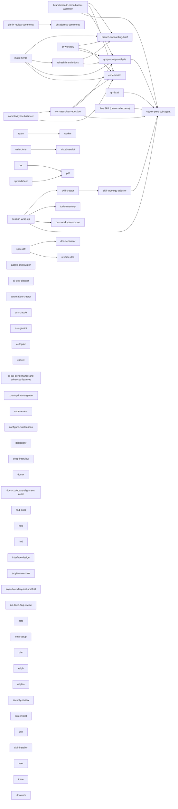

# Skill Topology

## Purpose

Define ownership and delegation boundaries across currently installed skills so specialist procedures live in one place and orchestrators stay thin.

## Ownership Rules

1. Keep specialist protocols in specialist skills.
2. Keep orchestration skills focused on sequence, gating, and output contracts.
3. Delegate by skill name; do not duplicate another skill's low-level checklist.
4. Keep delegation shallow by default: orchestrator -> specialist.
5. Allow one composed handoff only through designated `specialist-orchestrator` nodes when it replaces duplicated internals.

## Role Definitions

- `meta`: owns cross-skill creation or installation policy; either delegates explicitly or states that delegation is optional.
- `utility`: reusable helper skill with a narrow operational responsibility and no ownership over foreign specialist internals.
- `specialist`: single-domain owner for one workflow or tool surface.
- `specialist-orchestrator`: owns a domain workflow plus one composed handoff to specialists inside that domain.
- `orchestrator`: owns multi-skill delivery flow and delegates domain internals outward.
- `meta-tool`: cross-cutting execution surface that can be reused by any skill role without becoming an installed ownership node.

## Role Map

| Skill | Role | Primary Ownership |
| --- | --- | --- |
| `skill-creator` | meta | skill structure/content workflow and validation handoff rules |
| `skill-installer` | meta | curated or repo-backed skill installation flow |
| `skill-topology-adjuster` | utility | topology role classification, ownership boundaries, and delegation graph updates |
| `find-skills` | utility | discover installable skills and recommend install paths |
| `automation-creator` | utility | Codex automation directive authoring |
| `ask-claude` | utility | local Claude CLI consultation with reusable artifact capture |
| `ask-gemini` | utility | local Gemini CLI consultation with reusable artifact capture |
| `cancel` | utility | active OMX mode cancellation and cleanup |
| `configure-notifications` | utility | OMX notification configuration across supported platforms |
| `doctor` | utility | oh-my-codex installation diagnostics and remediation |
| `help` | utility | explain OMX behaviors, shortcuts, and user-facing operation |
| `hud` | utility | HUD display/statusline configuration |
| `note` | utility | durable note capture into `.omx/notepad.md` |
| `omx-setup` | utility | oh-my-codex setup and refresh workflow |
| `omx-workspace-prune` | utility | safe `.omx` workspace pruning and retention policy |
| `ralplan` | utility | alias surface for `$plan --consensus` |
| `skill` | utility | local skill management CLI workflow |
| `trace` | utility | OMX trace timeline and summary reporting |
| `todo-inventory` | utility | repository TODO inventory and diff-added TODO summaries |
| `worker` | utility | tmux team worker protocol and mailbox lifecycle |
| `agents-md-builder` | specialist | AGENTS.md authoring and repo-specific instruction synthesis |
| `ai-slop-cleaner` | specialist | anti-slop cleanup/refactor workflow with regression-safety bias |
| `branch-onboarding-brief` | specialist | branch diff onboarding and briefing |
| `code-health` | specialist | code-health pipeline and risk summary |
| `code-review` | specialist | comprehensive code review with severity-rated findings |
| `desloppify` | specialist | desloppify scanner-driven debt reduction workflow |
| `doc` | specialist | DOCX editing and conversion workflow |
| `doc-separator` | specialist | mixed-document Tobe/As-Is separation |
| `docs-codebase-alignment-audit` | specialist | deterministic docs/codebase alignment audit and minimal-diff fixes |
| `gh-address-comments` | specialist | PR comment retrieval and response workflow |
| `gh-fix-ci` | specialist | GitHub Actions failure triage and fix gating |
| `gh-fix-review-comments` | specialist-orchestrator | end-to-end PR review fix, commit, push, reply, and resolve workflow |
| `interface-design` | specialist | intentional interface design workflow for app/product UI tasks |
| `jupyter-notebook` | specialist | notebook scaffold/edit workflow |
| `cp-sat-performance-and-advanced-features` | specialist | advanced CP-SAT performance tuning, log forensics, and scaling workflow |
| `cp-sat-primer-engineer` | specialist | OR-Tools CP-SAT modeling, debugging, and productionization workflow |
| `layer-boundary-test-scaffold` | specialist | scaffold and extend AST-based architecture boundary tests |
| `no-deep-flag-review` | specialist | review deep flag-passing violations and minimal fix direction |
| `pdf` | specialist | PDF rendering and visual QA |
| `reverse-doc` | specialist | code-to-As-Is documentation workflow |
| `screenshot` | specialist | OS-level screenshot capture |
| `security-review` | specialist | focused security audit for code and configuration |
| `spec-diff` | specialist | Tobe/As-Is drift comparison workflow |
| `spreadsheet` | specialist | Python/openpyxl spreadsheet modeling and editing workflow |
| `visual-verdict` | specialist | structured screenshot-to-reference visual QA verdicts |
| `yeet` | specialist | explicit stage/commit/push/PR one-shot workflow |
| `deep-interview` | specialist-orchestrator | ambiguity-gated requirement interview with bounded planning handoff |
| `grepai-deep-analysis` | specialist-orchestrator | deep code analysis protocol with bounded augmentation handoff |
| `refresh-branch-docs` | specialist-orchestrator | doc impact mapping and branch-grounded doc rewrite |
| `non-test-bloat-reduction` | specialist-orchestrator | per-commit non-test intent compression and bloat reduction |
| `web-clone` | specialist-orchestrator | URL-driven website cloning with iterative visual verification handoff |
| `autopilot` | orchestrator | end-to-end autonomous delivery from idea to verified code |
| `branch-health-remediation-workflow` | orchestrator | branch onboarding + health + grepai remediation synthesis |
| `complexity-loc-balancer` | orchestrator | complexity reduction with non-test net growth guardrail |
| `main-merge` | orchestrator | merge sequence and conflict/doc handoff |
| `plan` | orchestrator | strategic planning with direct or interview-driven intake |
| `pr-workflow` | orchestrator | PR briefing/creation flow and release gating |
| `ralph` | orchestrator | persistence loop with architect verification until completion |
| `session-wrap-up` | orchestrator | session-end insight synthesis and skill/topology handoff |
| `team` | orchestrator | tmux-based coordinated multi-agent execution |
| `ultrawork` | orchestrator | parallel execution engine for independent task lanes |

## Orchestration Layers

```text
Layer 0: Meta / Utility
  skill-creator, skill-installer, skill-topology-adjuster, find-skills,
  automation-creator, ask-claude, ask-gemini, cancel,
  configure-notifications, doctor, help, hud, note, omx-setup,
  omx-workspace-prune, ralplan, skill, trace, todo-inventory, worker

Layer 1: Specialists (single-domain ownership)
  agents-md-builder, ai-slop-cleaner, branch-onboarding-brief, code-health,
  code-review,
  cp-sat-performance-and-advanced-features, cp-sat-primer-engineer,
  desloppify, doc, doc-separator,
  docs-codebase-alignment-audit, gh-address-comments, gh-fix-ci,
  interface-design, jupyter-notebook, layer-boundary-test-scaffold,
  no-deep-flag-review, pdf, reverse-doc, screenshot, security-review,
  spec-diff, spreadsheet, visual-verdict, yeet

Layer 2: Specialist-Orchestrators (domain workflow + bounded handoff)
  deep-interview, gh-fix-review-comments, grepai-deep-analysis, refresh-branch-docs,
  non-test-bloat-reduction, web-clone

Layer 3: Primary Orchestrators (task-level delivery ownership)
  autopilot, branch-health-remediation-workflow, complexity-loc-balancer,
  main-merge, plan, pr-workflow, ralph, session-wrap-up, team,
  ultrawork

Layer 4: Sub-Agent Preferred Activators (optional, scenario-bound)
  branch-health-remediation-workflow, gh-fix-ci, grepai-deep-analysis,
  non-test-bloat-reduction, skill-topology-adjuster, session-wrap-up
```

`codex-exec-sub-agent` remains a cross-cutting `meta-tool` runtime lane, but it is not currently an installed skill under `$CODEX_HOME/skills`; represent it only as optional runtime delegation (`Any Skill` -> `codex-exec-sub-agent`), not as an installed role-map node.

## Sub-Agent Activation Scenarios

| Skill | Prefer `codex-exec-sub-agent` When... | Expected Benefit |
| --- | --- | --- |
| grepai-deep-analysis | grep/search results are noisy across many modules and retries are needed | fresh context per cycle, less context contamination |
| branch-health-remediation-workflow | branch evidence collection spans onboarding + health + deep analysis | isolate heavy scans and keep the orchestrator thin |
| non-test-bloat-reduction | repeated candidate-cluster sweeps are needed over broad code areas | bounded long-running passes with traceable logs |
| skill-topology-adjuster | strict parity checks or O(N^2) overlap validation is requested | independent verification lane for drift adjudication |
| session-wrap-up | retrospective requires broad evidence mining before synthesis | offload heavy background scans while preserving summary context |
| gh-fix-ci | Actions logs are large, multi-run, or require repeated forensic extraction | isolate log-heavy analysis with reproducible artifacts |

## Delegation Graph


```mermaid
flowchart LR
  BHRW["branch-health-remediation-workflow"] --> BOB["branch-onboarding-brief"]
  BHRW --> CH["code-health"]
  BHRW --> GDA["grepai-deep-analysis"]

  NTBR["non-test-bloat-reduction"] --> CH
  NTBR --> GDA

  CLB["complexity-loc-balancer"] --> NTBR
  CLB --> CH

  MM["main-merge"] --> BOB
  MM --> RBD["refresh-branch-docs"]
  MM --> GDA
  MM --> CH

  RBD --> BOB
  RBD --> GDA

  PR["pr-workflow"] --> BOB
  PR --> CH
  PR --> GDA

  GFRC["gh-fix-review-comments"] --> GHC["gh-address-comments"]

  SWU["session-wrap-up"] --> SC["skill-creator"]
  SWU --> TI["todo-inventory"]
  SWU --> OWP["omx-workspace-prune"]
  SC --> STA["skill-topology-adjuster"]
  TEAM["team"] --> WORKER["worker"]
  WCL["web-clone"] --> VV["visual-verdict"]

  DOC["doc"] --> PDF["pdf"]
  SPD["spec-diff"] --> DSEP["doc-separator"]
  SPD --> RD["reverse-doc"]
  SS["spreadsheet"] --> PDF

  AMB["agents-md-builder"]
  AISC["ai-slop-cleaner"]
  AC["automation-creator"]
  ACLA["ask-claude"]
  AGEM["ask-gemini"]
  AP["autopilot"]
  CAN["cancel"]
  CSPA["cp-sat-performance-and-advanced-features"]
  CPS["cp-sat-primer-engineer"]
  CR["code-review"]
  CN["configure-notifications"]
  DES["desloppify"]
  DI["deep-interview"]
  DOCR["doctor"]
  DCAA["docs-codebase-alignment-audit"]
  FS["find-skills"]
  GHF["gh-fix-ci"]
  GFRC["gh-fix-review-comments"]
  GHC["gh-address-comments"]
  HELP["help"]
  HUD["hud"]
  IFD["interface-design"]
  JNB["jupyter-notebook"]
  LBTS["layer-boundary-test-scaffold"]
  NDF["no-deep-flag-review"]
  NOTE["note"]
  OSET["omx-setup"]
  PLAN["plan"]
  RALPH["ralph"]
  RLP["ralplan"]
  SECR["security-review"]
  SHOT["screenshot"]
  SKILL["skill"]
  SI["skill-installer"]
  YEET["yeet"]
  TRC["trace"]
  TI["todo-inventory"]
  UW["ultrawork"]
  VV["visual-verdict"]
  WCL["web-clone"]
  WORKER["worker"]

  ANY["Any Skill (Universal Access)"] --> CESA["codex-exec-sub-agent"]
  GDA --> CESA
  BHRW --> CESA
  NTBR --> CESA
  STA --> CESA
  SWU --> CESA
  GHF --> CESA
```

`codex-exec-sub-agent` is documented here as a reusable runtime meta-tool only. It is not part of the installed-skill role map for this snapshot.

## Delegation Tree (Operational View)


```mermaid
flowchart TD
  ROOT["Skill Topology"]

  ROOT --> ORCH["Primary Orchestrators"]
  ROOT --> HYB["Specialist-Orchestrators"]
  ROOT --> SPEC["Specialists"]
  ROOT --> META["Meta / Utility"]

  ORCH --> BHRW["branch-health-remediation-workflow"]
  ORCH --> CLB["complexity-loc-balancer"]
  ORCH --> MM["main-merge"]
  ORCH --> AP["autopilot"]
  ORCH --> PLAN["plan"]
  ORCH --> PR["pr-workflow"]
  ORCH --> RALPH["ralph"]
  ORCH --> SWU["session-wrap-up"]
  ORCH --> TEAM["team"]
  ORCH --> UW["ultrawork"]

  HYB --> DI["deep-interview"]
  HYB --> GFRC["gh-fix-review-comments"]
  HYB --> GDA["grepai-deep-analysis"]
  HYB --> NTBR["non-test-bloat-reduction"]
  HYB --> RBD["refresh-branch-docs"]
  HYB --> WCL["web-clone"]
  GFRC --> GHC["gh-address-comments"]

  SPEC --> AMB["agents-md-builder"]
  SPEC --> AISC["ai-slop-cleaner"]
  SPEC --> BOB["branch-onboarding-brief"]
  SPEC --> CH["code-health"]
  SPEC --> CR["code-review"]
  SPEC --> CSPA["cp-sat-performance-and-advanced-features"]
  SPEC --> CPS["cp-sat-primer-engineer"]
  SPEC --> DES["desloppify"]
  SPEC --> DOC["doc"]
  SPEC --> DSEP["doc-separator"]
  SPEC --> DCAA["docs-codebase-alignment-audit"]
  SPEC --> GHF["gh-fix-ci"]
  SPEC --> GHC["gh-address-comments"]
  SPEC --> IFD["interface-design"]
  SPEC --> JNB["jupyter-notebook"]
  SPEC --> LBTS["layer-boundary-test-scaffold"]
  SPEC --> NDF["no-deep-flag-review"]
  SPEC --> PDF["pdf"]
  SPEC --> RD["reverse-doc"]
  SPEC --> SECR["security-review"]
  SPEC --> SHOT["screenshot"]
  SPEC --> SPD["spec-diff"]
  SPEC --> SS["spreadsheet"]
  SPEC --> VV["visual-verdict"]
  SPEC --> YEET["yeet"]

  META --> SC["skill-creator"]
  META --> SI["skill-installer"]
  META --> STA["skill-topology-adjuster"]
  META --> FS["find-skills"]
  META --> AC["automation-creator"]
  META --> ACLA["ask-claude"]
  META --> AGEM["ask-gemini"]
  META --> CAN["cancel"]
  META --> CN["configure-notifications"]
  META --> DOCR["doctor"]
  META --> HELP["help"]
  META --> HUD["hud"]
  META --> NOTE["note"]
  META --> OSET["omx-setup"]
  META --> OWP["omx-workspace-prune"]
  META --> RLP["ralplan"]
  META --> SKILL["skill"]
  META --> TRC["trace"]
  META --> TI["todo-inventory"]
  META --> WORKER["worker"]

  BHRW --> BOB
  BHRW --> CH
  BHRW --> GDA

  NTBR --> CH
  NTBR --> GDA

  CLB --> NTBR
  CLB --> CH

  MM --> BOB
  MM --> RBD
  MM --> GDA
  MM --> CH

  RBD --> BOB
  RBD --> GDA

  PR --> BOB
  PR --> CH
  PR --> GDA

  SWU --> SC
  SWU --> TI
  SWU --> OWP
  SC --> STA
  TEAM --> WORKER
  WCL --> VV

  DOC --> PDF
  SPD --> DSEP
  SPD --> RD
  SS --> PDF

  ANY["Any Skill (Universal Access)"] --> CESA["codex-exec-sub-agent"]
  GDA --> CESA
  BHRW --> CESA
  NTBR --> CESA
  STA --> CESA
  SWU --> CESA
  GHF --> CESA
```

## Refactor Checklist

1. Identify duplicated procedures in non-owning skills.
2. Move details to the owning skill.
3. Replace duplicates with explicit delegation text.
4. Validate all edited skills with `quick_validate.py`.

## New Skill Onboarding Checklist

1. Classify the new skill role: `specialist`, `orchestrator`, `specialist-orchestrator`, `meta`, `utility`, or `meta-tool`.
2. Add the skill to the role map.
3. Add delegation edges to the graph only when they are real runtime handoffs.
4. Mirror every graph edge in the delegation tree in the same change.
5. Keep delegation depth to one hop by default.
6. Ensure specialist internals are not duplicated in orchestrators.
7. Validate edited skills with `quick_validate.py`.
